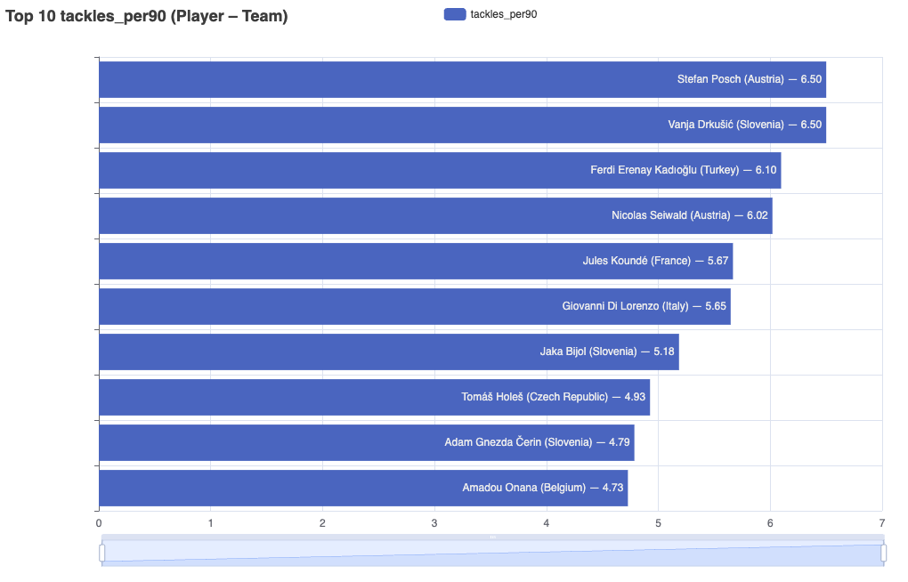

# Exploratory Data Analysis — Introduzione e guida (Generale, Giocatori, Squadre)

L’**Exploratory Data Analysis (EDA)** è la fase di esplorazione e comprensione iniziale dei dati:  
- permette di verificare la qualità e la completezza del dataset,  
- di scoprire pattern, relazioni e anomalie,  
- e di individuare le variabili più rilevanti da utilizzare in fase di modellazione predittiva.  

In altre parole, l’EDA è il ponte tra la raccolta dei dati e la costruzione dei modelli, e serve a trasformare dati grezzi in insight utili.

## INTRODUZIONE ALL'EDA NEL PROGETTO
Il file `features_all.csv` (creato tramite `create_features_all.py`) è stato prodotto con l’obiettivo principale di consentire un’analisi esplorativa dei dati (EDA).  
Gli scopi dell’EDA in questo progetto sono:
- comprendere relazioni chiave (Market Value vs fee),
- verificare qualità/completezza dei dati,
- definire feature robuste per i modelli.

Livelli:
- **Generale** (finestre, MV/fee, correlazioni),
- **Giocatori** (minuti, per-90),
- **Squadre** (aggregati e per-90 su base partite giocate).

Output: i grafici HTML sono creati sotto `artifacts/eda_general`, `artifacts/eda_players`, `artifacts/eda_teams`.

## PARAMETRI INCLUSI IN `features_all.csv`
Le colonne principali calcolate e utilizzate nel file sono:

- **Identificativi**: `player_id`, `player_name`, `team_id`, `team_name`, `primary_position`
- **Volumi base**: `minutes`, `matches`, `starts`
- **Azioni offensive**: `goals`, `shots`, `xg`, `xa`
- **Passaggi**: `passes`, `passes_completed`, `pass_pct`
- **Azioni difensive**: `tackles`, `dribbles`, `pressures`, `interceptions`, `clearances`
- **Falli e disciplinare**: `fouls_committed`, `fouls_won`, `yellow_cards`, `red_cards`
- **Per-90 metrics**: `goals_per90`, `shots_per90`, `xg_per90`, `xa_per90`,  
  `tackles_per90`, `dribbles_per90`, `pressures_per90`, `interceptions_per90`,  
  `clearances_per90`, `fouls_committed_per90`, `fouls_won_per90`
- **Derivate**: `minutes_per_match`, `pos_bucket`
- **Transfermarkt**: `tm_player_id`, `transfer_date`, `transfer_fee`, `mv_pre_euro`, `mv_pre_euro_date`
- **Relazioni economiche**: `fee_over_mv_pre`, `days_since_mv_pre`
- **Demografia**: `age_years`, `tm_height_cm`, `tm_position`, `tm_foot`

## CONSIDERAZIONI SU MV PRE E MV POST

**Scatter Plot tra la TRANSFER FEE e il MARKET VALUE per giocatori con trasferimenti dopo EURO24**:

  

Osservazioni (schema):
- MV post è il driver di “livello” della transfer_fee; il modello dovrà lavorare sull’uplift rispetto a MV.  
- _Le transfer_fee risultano in media superiori al market value post-EURO24 di **347.078,95 €**. Questo differenziale medio può essere letto come un “premio torneo”, ossia un aumento di valutazione indotto dalla visibilità e dalla performance nella competizione, che si manifesta più spesso in positivo che in negativo._  
- MV pre e MV post sono molto correlati → usare MV post evita ambiguità di cutoff e semplifica l’inferenza.

## MATRICE DI CORRELAZIONE
Il file `eda_general/heatmap_correlation_top_features.html` mostra la matrice di correlazione per le TOP FEATURES. Si può notare chiaramente la correlazione tra transfer_fee e MV sia PRE che POST. Da notare anche la discreta correlazione dei _minutes_ alla transfer_fee: più un giocatore ha giocato durante il torneo, più in media risulta associato a un valore elevato.

## EDA_PLAYERS (giocatori)
- Scopo: descrivere contributi individuali con per-90 stabili (cap ≥ 180’), evidenziare outlier e trend.
- I grafici sono al percorso `artifacts/eda_players/` e raccontano EURO24 sotto vari punti di vista. In particolare:
  - `scatter_xg_per90_vs_goals_per90.html` — calibrazione tra xG e gol.  
  - `scatter_xg_per90_vs_xa_per90.html` — profili finalizzatore vs creatore.  
  - `scatter_pass_pct_vs_passes_completed.html` — qualità vs volume in costruzione.  
  - `scatter_interceptions_per90_vs_tackles_per90.html` — profilo difensivo per ruolo.  
  - `bar_top_<metric>.html` (xg/xa/goals/tackles/…) — top performer per metrica.  

**Stats Players**:

  
  

  
  

  
  

Note di lettura:
- Cristiano Ronaldo, durante il torneo, ha mostrato un’elevata propensione al tiro ma una bassa conversione in gol, come evidenziato dai grafici sopra.  
- xg/90 e xa/90 sono più stabili di goals/90; applicare un valore minimo di minutaggio permette di filtrare gli outlier.  
- Interessante l’andamento a mezzaluna del grafico su pass% vs passaggi completati: i giocatori con pochi passaggi mostrano percentuali molto variabili, mentre con l’aumentare del volume la precisione converge verso valori più stabili.

## EDA_TEAMS (squadre)
- Scopo: confrontare profili di squadra (offensivo/difensivo/costruzione) in modo comparabile.
- I grafici sono al percorso `artifacts/eda_teams/` e raccontano le performance delle squadre EURO24 sotto vari punti di vista. In particolare:
  - `scatter_team_xg_per90_vs_xa_per90.html` — profili di squadra offensivi vs creativi.  
  - `scatter_team_tackles_per90_vs_interceptions_per90.html` — intensità e qualità difensiva.  
  - `scatter_team_passes_per90_vs_interceptions_per90.html` — costruzione vs recupero palla.  
  - `scatter_team_dribbles_per90_vs_assists_per90.html` — 1vs1 e rifinitura.  
  - `bar_team_sum_<metric>.html` — volumi assoluti (xg/xa/shots/goals/tackles/interceptions…).  
  - `bar_team_xg_per90.html`, `bar_team_xa_per90.html` — produzione per partita.  

**Stats Teams**:

  
  

  
  

Note di lettura:
- **xG vs xA per 90’**: Spagna e Portogallo si distinguono come squadre offensive complete, con alti valori sia di expected goals (finalizzazione) che di expected assists (creazione).  
- **Passes vs Interceptions per 90’**: Austria e Slovenia emergono con un’intensità difensiva molto alta (intercetti elevati), mentre squadre come Inghilterra e Portogallo mostrano grandi volumi di passaggi, segnalando uno stile più orientato al possesso.  
- **Sum pressures**: la Spagna spicca nettamente come squadra più aggressiva in pressione, seguita da Inghilterra e Svizzera; Portogallo, Germania e Olanda hanno valori intermedi, segno di un pressing più selettivo.  
- **Tackles vs Interceptions per 90’**: Austria e Slovenia si confermano tra le squadre più difensive, con valori alti su entrambe le metriche, mentre Inghilterra e Belgio risultano più bassi, indicando un approccio difensivo meno intenso o più basato sul controllo palla.

  

- **Avg transfer fee vs Avg market value**: sorprendentemente, le squadre top performer (es. Spagna, Germania, Francia, Inghilterra) non mostrano incrementi medi significativi delle transfer fee rispetto al market value. Questo può sembrare controintuitivo, ma la spiegazione più plausibile è la scarsità di trasferimenti registrati (poche osservazioni per squadra) e la concentrazione delle fee su pochi giocatori chiave, che limita la rappresentatività del dato medio.

---

### CONSIDERAZIONE FINALE
In sintesi, l’EDA e la fase di Training dei modelli conferma che:
- **Il Market Value post-torneo rimane il driver principale delle valutazioni**, mentre le transfer fee si muovono soprattutto come deviazioni (uplift) rispetto a tale baseline.  
- **I driver secondari dell’uplift sono soprattutto demografici/strutturali** (età, altezza, posizione), con contributi aggiuntivi legati alla visibilità e alle performance eccezionali nel torneo (exploit individuali).  
- **A livello di squadra** emergono chiari profili tattici (possessione, pressing, difesa intensa) che aiutano a interpretare le prestazioni, anche se non sempre si riflettono in variazioni significative di mercato per via del numero ridotto di trasferimenti.  

Queste evidenze supportano la scelta di **modelli semplici e robusti**, capaci di catturare i driver principali senza disperdere segnale su troppe variabili poco informative.
