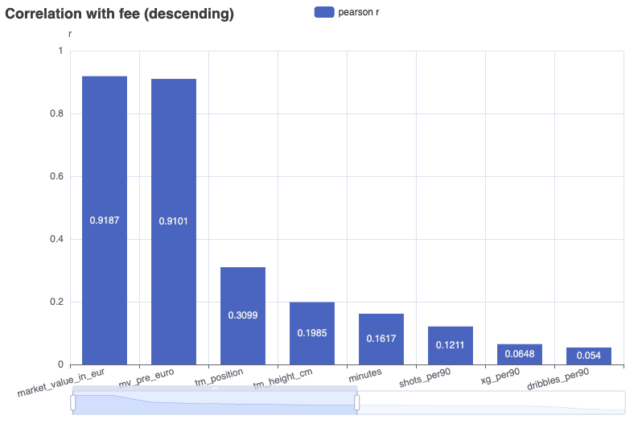
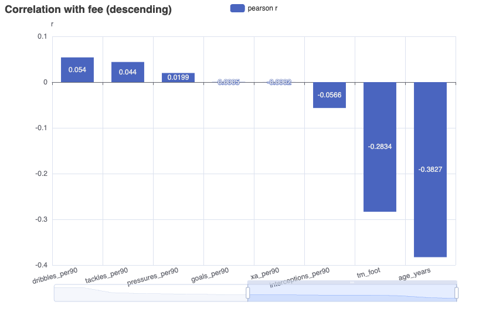
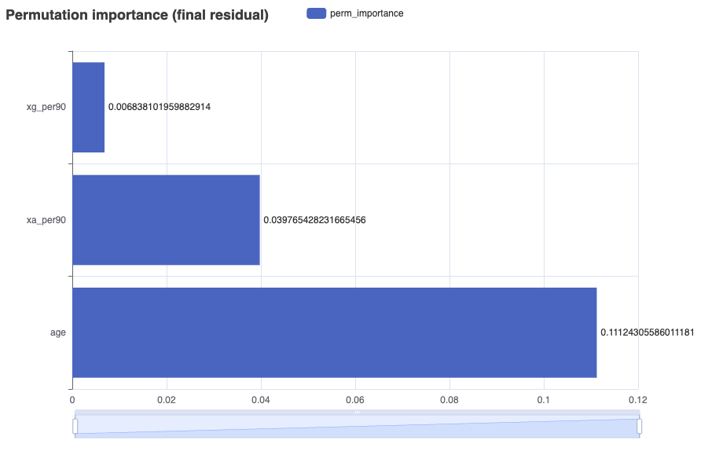
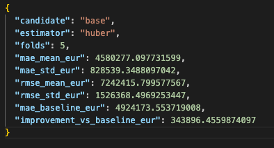
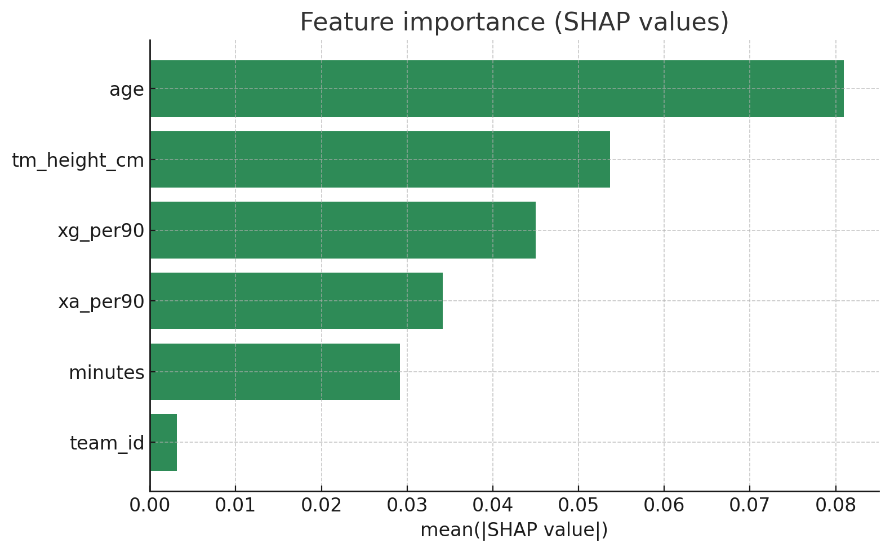

# Modeling — Predicting EURO24 Transfer Value

Questa nota sintetizza: (1) le feature emerse dall'EDA e usate nei modelli, (2) il percorso degli esperimenti e perché si è passati a uno storico “ALL tournaments”, (3) le due soluzioni finali consegnate: `model_final` (residual, set of candidate estimators) e `model_final_rf` (RandomForest residuo, spesso il migliore).

## Feature individuate (da EDA → modello)
- Segnale di livello: `market_value_in_eur` (MV post). È la baseline naturale e il driver principale del livello prezzo.
- Età: `age` — effetto non lineare (premio giovani, penalità a fine carriera); in modelli lineari serve standardizzazione; nei tree è gestito nativamente.
- Performance per‑90 (cap minimo 180’ per stabilità): `xg_per90`, `xa_per90`; talvolta `goals_per90`, `tackles_per90`, `interceptions_per90`, `pressures_per90`.
- Contesto: `team_id` (one‑hot con min_frequency), utili differenze di nazionale; demografica TM: `tm_height_cm`, `tm_position`, `tm_foot` (ultime due come categoriche a bassa cardinalità).
- Pulizia e robustezza: winsorization delle per‑90 (1–2%), imputazione robusta, gestione stringhe vuote → NaN.
  - Gestione NULL/valori mancanti (coerente tra training e predict):
    - Numeriche (es. `minutes`, per‑90, `age`, `tm_height_cm`, `market_value_in_eur`): le stringhe vuote vengono convertite in `NaN`; l’imputazione avviene nel pipeline con mediana (SimpleImputer strategy=median). In alcune fasi di training, righe senza MV possono essere droppate (per evitare target inconsistenti); in inference, se MV manca la `pred_fee` risulta `NaN` (coerente con il residuo che ricostruisce dalla MV).
    - Categoriche TM (es. `tm_position`, `tm_foot`): default espliciti per robustezza — `tm_position = "Unknown"`, `tm_foot = "right"` quando vuoti/NaN; OneHot con `handle_unknown=ignore` e `min_frequency` per ridurre rumore.
    - XRef: per l’inferenza “all players” si usa lo STRICT (`player_xref`); dove il join verso `tm_players` non trova match, i campi TM restano `NaN` e il modello si affida all’imputazione/robustezza del residuo (o produce `pred_fee=NaN` se manca MV).

<!--  -->

**Grafico di correlazione tra le features individuate e la transfer_fee**:
<p align="center">
  
  
</p>

## Percorso e ragionamenti (come si è arrivati alla soluzione)
- **EURO24‑only (pochi casi ≈ decine)**: sono state provate versioni basic/complex (residuo) con Ridge, K‑Fold e sweep di feature. Per ridurre overfitting si è tagliato molto (poche feature, forte regolarizzazione), ma la varianza restava alta e i risultati instabili su split temporali. I tentativi sono tracciati in `artifacts/…` (cartelle di lavoro e confronti).
- **Estensione a nazionali dal 2018 (ALL tournaments)**: per aumentare stabilità e capacità di generalizzare, si è allenato su aggregati multi‑torneo con finestre post‑competizione (90gg). Qui il target “residuo” diventa cruciale: `y_resid = log1p(fee) − log1p(MV)`, così il modello impara l’uplift oltre MV.
- **Selezione time‑aware e guardrail**: si usa CV a blocchi temporali (forward‑chaining) per selezionare combinazioni di feature/modello conservative. Sullo split holdout, si sceglie la prima combinazione tra le top di CV che batte la baseline MV; altrimenti fallback alla baseline. Questo garantisce che la soluzione consegnata non peggiori mai rispetto a MV.

### Esperimenti Iniziali
- Sono state provate varianti basic/complex su EURO24‑only con Ridge e K‑Fold: con pochi esempi, anche con forti regolarizzazioni la varianza restava alta e i risultati non erano stabili né sistematicamente sopra la baseline rappresentata dal Market Value.
- Sono stati testati Random Forest e XGBoost, con quest'ultimo che è stato scartato a causa di performance peggiori
- L’EDA ha confermato che MV domina il segnale di livello; le per‑90 (xg/xa) e l’età aggiungono uplift, ma la scarsità di casi riduce l’affidabilità delle stime.
- Per questo si è passati a uno storico multi‑torneo (ALL), mantenendo il target residuo e una selezione time‑aware con guardrail, poi applicando il modello su EURO24.

Di seguito i due modelli finali consegnati e come ci si è arrivati.

## Soluzione 1 — `model_final` (Residual, set of candidate estimators)
- Idea: cerchiamo una combinazione semplice ma robusta che batta la baseline su holdout.
- Pipeline: feature set iterativo (base → +minutes → +team_id → +height), target residuo, candidati di modello (Ridge α∈{3,10,30}, Huber, RF regolarizzato), winsor per‑90, imputazione numerici (mediana), one‑hot categoriche.
- Selezione: CV time‑forward, ordinamento per ΔMAE vs baseline; su holdout si prende la prima che supera MV (guardrail). Metadati completi in `metrics.json` (`cv_best`, `cv_tried`, `holdout`).
- Come si lancia (già integrato in `run.sh`):
  - ALL: `python -m src.model.train_final --db data/db/all_tournaments.sqlite --out artifacts/model_final_all --k 5 --cv-mode time --min-minutes 180 --top-n-holdout 5`
  - EURO24: `python -m src.model.train_final --db data/db/euro24.sqlite --out artifacts/model_final_euro24 --k 5 --cv-mode time --min-minutes 180 --top-n-holdout 5`
- Predizioni finali EURO24 (all players, XRef STRICT):
  - `python -m src.model.predict_euro24 --db data/db/euro24.sqlite --model artifacts/model_final_all/model.joblib --out artifacts/predictions_euro24_all_players.csv --scope all --age-ref-date 2024-07-01`

**Valutazione (metriche)**:
- Qualità giudicata su holdout time‑aware con MAE/RMSE in euro e Δ MAE rispetto alla baseline MV (positivo = meglio della baseline).
- In selezione si riporta anche la media CV time‑forward di MAE/RMSE per evitare scelte dipendenti da un singolo split.
- Guardrail attivo: se l’holdout non batte MV si consegna la baseline (residuo zero).

**Grafici di Permutation Importance e Calcolo Metriche**
<p align="center">
  
  
</p>


## Soluzione 2 — `model_final_rf` (RandomForest residuo, spesso il migliore)
- Idea: stesso target residuo e feature set conservativo, ma con RandomForest regolarizzato (profondità, min_samples_leaf, max_features) e piccola griglia iperparametri; spesso risulta più stabile e sopra baseline.
- Selezione: stessa CV time‑forward e guardrail su holdout; SHAP per leggere i driver (es. età, xg/xa, height in alcuni ruoli) e confermare interpretabilità.
- Come si lancia (già in `run.sh`):
  - ALL: `python -m src.model.train_final_rf --db data/db/all_tournaments.sqlite --out artifacts/model_final_all_rf --k 5 --min-minutes 260 --top-n-holdout 5`
  - EURO24: `python -m src.model.train_final_rf --db data/db/euro24.sqlite --out artifacts/model_final_euro24_rf --k 5 --min-minutes 260 --top-n-holdout 5`
- Predizioni finali EURO24 (all players, XRef STRICT):
  - `python -m src.model.predict_euro24 --db data/db/euro24.sqlite --model artifacts/model_final_all_rf/model.joblib --out artifacts/predictions_euro24_rf_all_players.csv --scope all --age-ref-date 2024-07-01`

**Valutazione (metriche)**:
- Stesse metriche della Soluzione 1: MAE/RMSE su holdout time‑aware e Δ vs baseline MV; riportata anche la media CV time‑forward.
- Oltre alle permutazioni, si usa SHAP per verificare i driver dell’uplift (es. age, xg/xa, height) e coerenza con l’EDA.
- Anche qui il guardrail garantisce che il modello finale batta la baseline su holdout.

In CV (file `cv_best.json`), per la run migliore risulta:
- combo: `base+minutes+team+height`
- RF params: `n_estimators=1000`, `max_depth=16`, `min_samples_leaf=10`, `max_features='sqrt'`
- miglioramento medio vs baseline MV: ≈ +115k € (Δ MAE) — utile come indicazione di stabilità out‑of‑sample rispetto alla sola MV.


## MIGLIOR RUN

Con questo modello è stata individuata la miglior run selezionata: di seguito le caratteristiche.

- Dataset: `data/db/all_tournaments.sqlite`
- Numero Record che matchano i filtri, su cui è stato trainato il modello: 88
- Cleaning: rimosse 49 righe con `market_value_in_eur` mancante; filtrate per‑90 con winsor 1%; `minutes ≥ 260`.
- Target: residuo `y_resid = log1p(fee) − log1p(MV)` (MV non usato come feature del modello; usato solo per ricostruzione fee).
- Feature set scelto: `base+minutes+team+height`
  - base = `age`, `xg_per90`, `xa_per90`
  - + `minutes`
  - + `team_id` (OneHot, `min_frequency=5`)
  - + `tm_height_cm`
- Modello: RandomForestRegressor con
  - `n_estimators=1000`, `max_depth=16`, `min_samples_leaf=10`, `max_features='sqrt'`, `random_state=42`
- CV (selezione): time‑forward a 5 blocchi; ordinamento per miglioramento medio vs baseline Market Value.
- Holdout (test time‑aware, ultimo 20%):
  - MAE modello: 2,659,711 €
  - MAE baseline (MV): 3,986,111 €
  - Δ (miglioramento): +1,326,400 €
  - RMSE modello: 3,525,819 €
  
  In CV (file `cv_best.json`), per la run migliore risulta:
  - combo: `base+minutes+team+height`
  - RF params: `n_estimators=1000`, `max_depth=16`, `min_samples_leaf=10`, `max_features='sqrt'`
  - miglioramento medio vs baseline MV: ≈ +115k € (Δ MAE) — utile come indicazione di stabilità out‑of‑sample rispetto alla sola MV.
- Artifacts: `artifacts/model_final_all_rf/`
  - `metrics.json` (contiene `cv_best`, `cv_tried`, blocco `holdout` e `rf_params` selezionati)
  - `val_predictions_final_rf.csv`
  - `feature_importance_final_rf.html` (permutazione)
  - `feature_importance_final_rf_shap.csv` (SHAP)

_Spiegazione sintetica_
- Per evitare che il modello “insegua” il livello MV, adottiamo il modeling “residuo”: il RF impara solo l’uplift rispetto a MV; in predizione ricostruiamo la fee con `fee_hat = expm1(log1p(MV) + resid_hat)`.
- Si usa una CV coerente col tempo (forward‑chaining) per selezionare feature e iperparametri tra combinazioni conservative, poi si applica un guardrail: sull’holdout si sceglie la prima combinazione delle migliori in CV che batte MV, altrimenti fallback alla baseline.
- In questa run, la combinazione `base+minutes+team+height` con RF regolarizzato ha battuto la baseline sul test temporale con un miglioramento di ~0.97M € in MAE.

**SHAP**
<p align="left">
  
</p>


## Note su XRef e qualità dati

- **Matching giocatori (StatsBomb ↔ Transfermarkt)**: anche la variante “strict” può contenere errori sporadici per limiti intrinseci della _fuzzy logic_ (esempi: omonimie, nickname, mapping parziali). In questi casi si possono osservare abbinamenti scorretti (p.es. nomi simili ma persone diverse).
- **Impatto**: anomalie di XRef possono propagarsi a feature demografiche (età/altezza/piede) e a `market_value_in_eur`, influenzando EDA e training/prediction. I modelli residui mitigano in parte (tornano alla baseline quando il segnale è debole), ma è bene esserne consapevoli.
- **Mitigazioni pratiche suggerite**:
  - Tenere entrambe le varianti (`player_xref` e `player_xref_all`) e confrontare coverage/qualità per i casi critici.
  - Introdurre (o usare, se presenti) flag di revisione/manual review per i match dubbi prima dell’uso in analisi finali.
  - Per report ufficiali, verificare manualmente le entità più influenti (top importances SHAP) quando dipendono da campi TM.

**CONSIDERAZIONE**

_Nelle varie run sono state esplorate combinazioni diverse di feature: alcune (age, xg/xa per‑90, minutes, tm_height_cm, team_id) tendono a emergere con frequenza, ma data la scarsità di record non esiste un subset “fisso” che funzioni sempre. La selezione è stata quindi guidata dalla CV time‑forward e validata su holdout con guardrail, privilegiando configurazioni 
semplici e robuste rispetto alla sola MV._

## Export predizioni (EURO24)

- Lo script `run.sh` produce i file `artifacts/predictions_euro24_all_players.csv` usando il modello allenato su ALL tournaments.
- Per costruire il dataset dei giocatori EURO24 “all players” si usa lo XRef STRICT (`player_xref`) verso `tm_players` per evitare abbinamenti ambigui durante l’inferenza di massa. Questo può ridurre la copertura (alcuni giocatori potrebbero non avere MV e quindi `pred_fee`=NaN), ma migliora l’affidabilità dei match.
- Comando equivalente manuale:
  ```
  python -m src.model.predict_euro24 \
    --db data/db/euro24.sqlite \
    --model artifacts/model_final_all/model.joblib \
    --out artifacts/predictions_euro24_all_players.csv \
    --scope all --age-ref-date 2024-07-01
  ```
